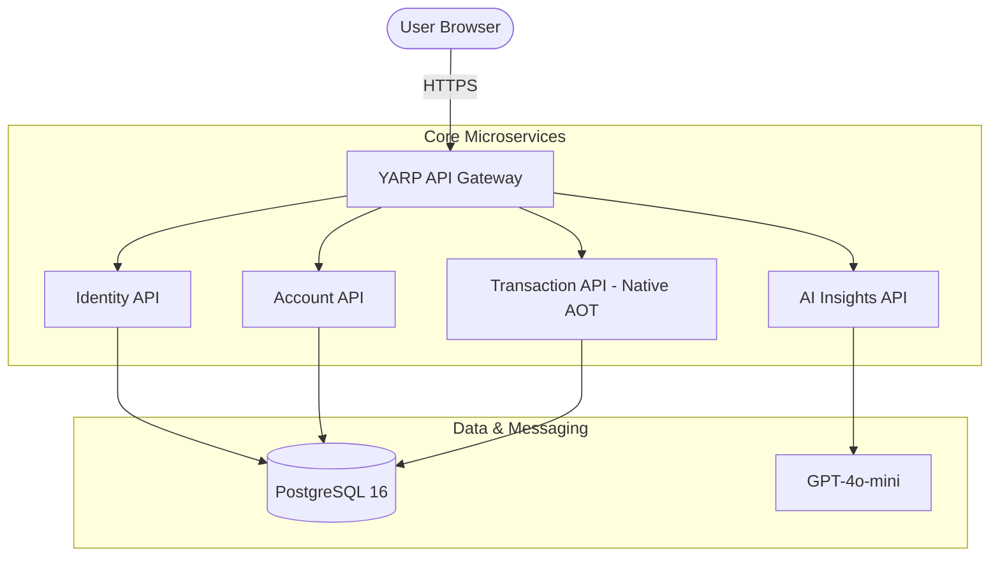

# 🏦 NeoBank Microservices Core - MVP

[](https://dotnet.microsoft.com/en-us/download/dotnet/10.0)
[](https://nextjs.org/)
[](https://learn.microsoft.com/en-us/dotnet/core/deploying/native-aot/)
[](https://learn.microsoft.com/en-us/semantic-kernel/)

A high-performance, modular digital banking core built with **ASP.NET Core Microservices** and **Next.js 15**. This project demonstrates the power of **Native AOT** for sub-50ms startup times and **Semantic Kernel** for intelligent financial insights.

---

## 🏗️ Architecture

The system follows a distributed microservices architecture coordinated by a central API Gateway.



---

## 🚀 Key Features

*   **Ultra-Fast Payments**: Transaction microservice compiled using **Native AOT**, ensuring near-instant cold starts and minimal RAM footprint.
*   **Intelligent Banking**: Real-time spending categorization and personalized saving suggestions powered by **Semantic Kernel** and **GPT-4o-mini**.
*   **Clean Architecture & CQRS**: Maintainable and scalable codebase using **MediatR** for Command/Query separation.
*   **Simplified Event Sourcing**: Every transaction is logged as an immutable event in the PostgreSQL `events` table for a complete audit trail.
*   **Premium UX**: A sleek, dark-themed dashboard built with **Tailwind CSS**, featuring glassmorphism and real-time data visualization.

---

## 🛠️ Tech Stack

### Backend (.NET 10)
- **ASP.NET Core Minimal APIs**
- **Entity Framework Core** (Npgsql)
- **MediatR** (CQRS Pattern)
- **Semantic Kernel** (AI Orchestration)
- **Native AOT** (High-Performance compilation)
- **YARP** (Reverse Proxy / API Gateway)

### Frontend (Next.js 15)
- **App Router** & **TypeScript**
- **Tailwind CSS** (Premium UI/UX)
- **TanStack Query** (State management)
- **Recharts** (Data visualization)
- **Lucide React** (Icons)

### Infrastructure
- **PostgreSQL 16** (Primary Database)
- **Docker & Docker Compose** (Orchestration)
- **GitHub Actions** (Planned CI/CD)

---

## 🏁 Getting Started

### Prerequisites
- [.NET 10 SDK](https://dotnet.microsoft.com/en-us/download/dotnet/10.0)
- [Node.js 22+](https://nodejs.org/)
- [Docker Desktop](https://www.docker.com/products/docker-desktop/)
- An **OpenAI API Key**

### 1. Clone & Setup
```bash
git clone https://github.com/your-username/neobank-core.git
cd neobank-core
```

### 2. Environment Variables
Create a `.env` file in the root directory:
```env
OPENAI_API_KEY=your_sk_key_here
```

### 3. Launch with Docker
```bash
docker-compose up --build
```

The system will be available at:
- **Frontend Dashboard**: [http://localhost:3000](http://localhost:3000)
- **API Gateway**: [http://localhost:5000](http://localhost:5000)

---

## 📊 Performance Benchmarks

| Metric | Target (MVP) | Tech Used |
| :--- | :--- | :--- |
| **Service Startup** | < 50ms | Native AOT |
| **Transaction Latency** | < 100ms (p95) | Minimal APIs |
| **Docker Image Size** | ~30MB | Jammy-chiseled + AOT |
| **AI Processing** | < 1.5s | GPT-4o-mini |

---

## 🔮 Roadmap

- [ ] **Phase 2**: Multi-currency support (USD/GBP) with real-time FX rates.
- [ ] **Phase 3**: Kafka integration for asynchronous event streaming.
- [ ] **Phase 4**: Real-time Credit Scoring using ML models.
- [ ] **Phase 5**: Mobile App (React Native) & SEPA integration.

---

## 📄 License
Distributed under the MIT License. See `LICENSE` for more information.

---

*Built with ❤️ for the future of digital banking.*
